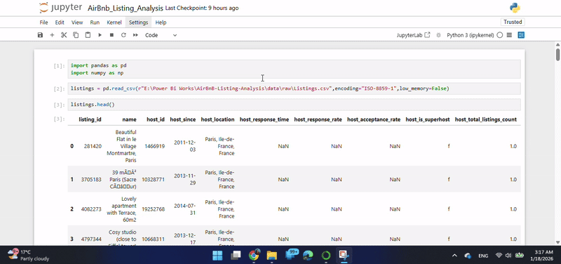

# Airbnb Listings Analysis (Paris) — Impact of 2015 Regulations on Hosts & Prices



## Overview
This project analyzes **Airbnb listings in Paris** to understand market patterns and highlight how **2015 regulations affected new host activity and listing prices**.  
The analysis focuses on identifying changes in hosting trends (especially for *new hosts*) and observing pricing behavior before and after the regulation period.

## Key Questions
- How did the **number of new hosts / new listings** change around **2015**?
- Did **average price** or **price distribution** shift after the regulation changes?
- Which neighborhoods / zones show stronger pricing signals?
- What host-related features (response rate, superhost status, etc.) correlate with pricing?

## Tools & Technologies
- **Python** (Pandas, NumPy)
- **Jupyter Notebook**
- Data cleaning, feature preparation, exploratory analysis, trend analysis, and visualization

## Dataset
- Source: Airbnb listings dataset (focused on **Paris**)
- Typical fields used:
  - `host_since`, `host_location`, `host_is_superhost`
  - `price`, `room_type`, `neighbourhood`, `availability`
  - host metrics like `host_response_rate`, `host_acceptance_rate` (where available)

> Note: Some host metrics may contain missing values depending on the dataset version.

## What I Did (Workflow)
1. **Loaded & filtered** the dataset for Paris listings
2. **Cleaned data**
   - handled nulls and inconsistent formats
   - converted date and price fields into analysis-friendly formats
3. **Created time-based features**
   - extracted year/month from host/listing timelines to track changes over time
4. **Exploratory Data Analysis**
   - listing count trends
   - host onboarding trends (new hosts)
   - price trends and distributions
5. **Regulation Impact Check (2015)**
   - compared growth patterns before vs after 2015
   - observed shifts in new host activity and pricing signals

## Highlights / Insights
- **New host growth shows a visible change around 2015**, suggesting regulatory impact on hosting activity.
- **Pricing behavior changes after 2015** (trend shift / distribution shift), indicating the market adapting to restrictions and compliance.
- Certain areas and listing types tend to maintain **higher price stability**, while others show more fluctuation.

*(Detailed charts and explanations are included inside the notebook / analysis file.)*

## Repository Structure
```text
Airbnb-Listings-Paris-Analysis/
│
├── data/
│   └── raw/
│       └── listings.csv
│
├── notebooks/
│   └── AirBnb_Listing_Analysis.ipynb
│
├── screenshots/
│   └── AirBnb-Listings-Analysis.gif
│
└── README.md
```

##How to Run This Project
Clone the repository:

git clone <your-repo-link>
cd Airbnb-Listings-Paris-Analysis

(Optional) Create and activate a virtual environment:

python -m venv venv
# Windows:
venv\Scripts\activate
# Mac/Linux:
source venv/bin/activate

##Install dependencies:

pip install pandas numpy matplotlib seaborn jupyter


Launch the notebook:

jupyter notebook


Open:

notebooks/AirBnb_Listing_Analysis.ipynb

Project Output

A full Paris-focused Airbnb listings analysis

Trend exploration showing how 2015 regulations influenced:

new host onboarding

pricing behavior

Limitations

Regulations are inferred from timeline patterns; proving causality would require:

official enforcement intensity by district

additional tourism/hotel demand signals

Missing values in host metrics may reduce correlation strength for some features.

##Future Improvements

Add neighborhood-level maps (price heatmaps)

Build a simple model to predict price drivers (baseline regression)

Compare Paris trends with another EU city as a control group

Add statistical testing for pre/post 2015 differences

Author

Shahin Shabab P
Data Analytics | SQL | Python | Tableau | Power BI | Excel

If you find this useful, feel free to ⭐ the repo!